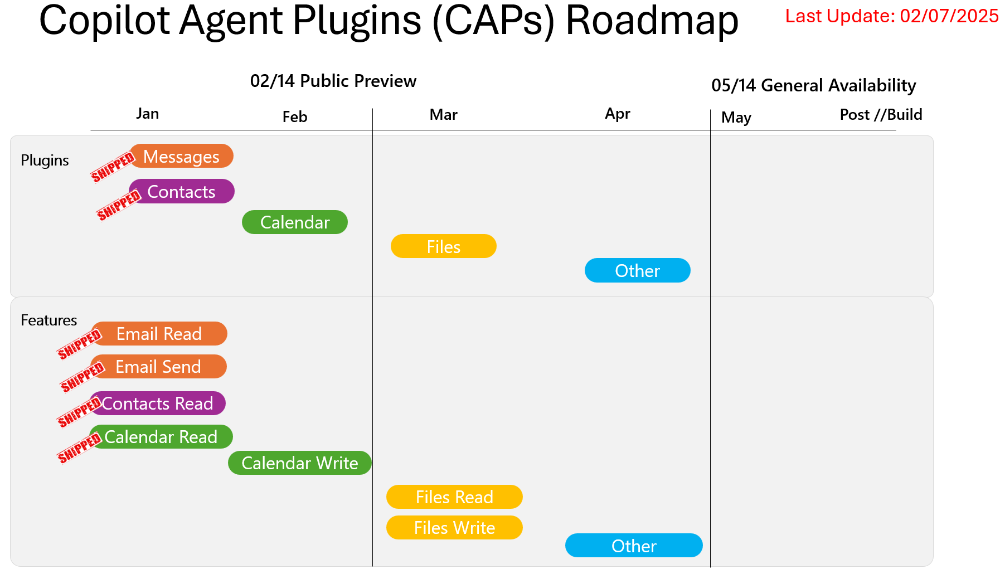

# Semantic Kernel MultiAgent Copilot Integration

Autonomous Multi-Agent Group Chat working with Copilot Agent Plugins in Microsoft Semantic Kernel.

- [Copilot Agent Plugins Sample for Semantic Kernel](https://github.com/microsoft/semantic-kernel/blob/c669f74099629db40c281397886ae5d81856e9e4/dotnet/samples/Demos/CopilotAgentPlugins/README.md)
- [text](https://github.com/fabianwilliams/LuxMentis/blob/0e385bdd690cbbc157c61ca9ca972001f56168e1/dotnet/CAPs/thefewtheprecisetheagents/Program.cs)

## Hire me

Please send [email](mailto:kingdavidconsulting@gmail.com) if you consider to **hire me**.

## Give a Star! :star:

If you like or are using this project to learn or start your solution, please give it a star. Thanks!

## Setup

[Setup Microsoft Entra App registration](./util/)

## References

[thefewtheprecisetheagents](https://github.com/fabianwilliams/LuxMentis/tree/main/dotnet/CAPs/thefewtheprecisetheagents)
[Fabian G Williams video](https://youtu.be/RYQmSbmd-WY)
